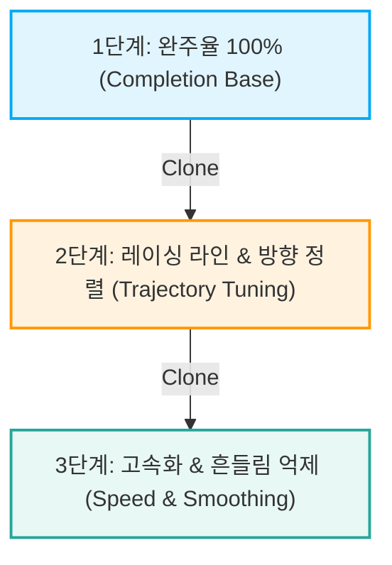

# AWS DeepRacer 세계 챔피언 & Physical 리그 우승 전략 분석

> **출처 및 레퍼런스**: AWS DeepRacer Championship Cup 우승자 분석, K1999 Racing Line Algorithm, RayG Optimal Path, DeepRacer Community Log Analysis

---

## 1. 챔피언들의 3대 핵심 알고리즘 & 전략

### 1.1 최적 주행선 (Optimal Racing Line) 사전 계산 기법 (K1999 / RayG 방식)
트랙의 단순 중앙선(Centerline)을 따라가면 코너마다 불필요한 급감속과 오버슈트가 발생합니다. F1 레이서처럼 **In-Out-In 궤적**을 사전에 계산하여 차량이 이 경로를 추종하도록 보상 함수를 구성합니다.

```
      [Straight] ─── (Out) ──┐
                             │ (Turn In)
                             ▼
                           (Apex / In) ──► (Exit / Out) ───► [Straight]
```

* **수학적 원리 (곡률 최소화 및 곡률 반경 극대화)**:
  궤적 점들의 집합 $(x_i, y_i)$에 대해 곡률 $\kappa_i$를 최소화하여 최대 허용 속도 $v_{max} = \sqrt{\mu g R}$ ($R = 1/\kappa$)를 확보합니다.
* **보상 설계 방식**:
  * $d_{racing\_line}$: 현재 차량 위치 $(x, y)$와 사전 계산된 최적 궤적 사이의 수직 거리.
  * 보상: $\text{Reward} \propto \exp(-\alpha \cdot d_{racing\_line}^2)$ 또는 연속 다단계 곱셈 페널티 적용.
* **간이 구현 기법 (Waypoint Curvature Heuristic)**:
  * 직전-현재-다음 Waypoint 3점 사이의 각도 변화량으로 코너 진입 여부를 감지.
  * 코너 진입 시점: 바깥쪽 유지 가산점.
  * 코너 중심(Apex): 안쪽 라인 밀착 가산점.

---

### 1.2 3단계 점진적 복제 학습 (Curriculum / Phased Clone Learning)
한 번에 고속 주행과 코너링을 모두 학습시키면 정책(Policy)이 수렴하지 못하고 무작위 탐색에 빠집니다.



| 단계 | 목표 | 권장 속도 | 보상 함수 초점 | 학습 시간 |
| :--- | :--- | :--- | :--- | :--- |
| **Phase 1** | 완주율 100% 확보 | 1.0 ~ 1.5 m/s | 트랙 중앙 유지, Off-track 페널티, 단순 진척도 | 40 ~ 60분 |
| **Phase 2** | Racing Line 추종 | 1.5 ~ 2.0 m/s | 최적 궤적 거리 오차 최소화, Heading 각도 일치 | 60분 |
| **Phase 3** | 랩타임 단축 & 흔들림 방지 | 1.8 ~ 2.4 m/s (Cap) | 코너별 가감속, 과도한 조향각 급변 페널티 | 30 ~ 45분 |

---

### 1.3 DeepRacer 로그 분석 (Log Analysis)
* 단순히 콘솔의 `Average Reward` 곡선만 보아서는 과적합(Overfitting) 여부를 알 수 없습니다.
* **주요 확인 지표**:
  1. **Heatmap of Track Trajectory**: 차량이 주로 이탈하는 '마의 구간(Bottleneck Corner)' 식별.
  2. **Steering vs. Speed Correlation**: 고속 영역에서 무리한 조향이 발생하는지 체크.
  3. **Evaluation Completion Consistency**: 5회 연속 평가에서 편차 없이 100% 완주하는지 확인.

---

## 2. Physical AI (실물 차량 트랙) 필승 노하우

실제 하드웨어(1/18 스케일 RC 카)는 가상 시뮬레이터와 물리적 환경이 다릅니다 (Sim-to-Real Gap).

### 2.1 지그재그 흔들림(Wobbling) 방지 (가장 중요 ⭐⭐⭐)
* **문제점**: 시뮬레이터와 달리 실제 모터는 지연 시간(Latency)과 관성이 존재하여 조향각이 빠르게 진동하면 타이어 접지력을 잃고 스핀합니다.
* **해결책**:
  * **조향각 절대값 제한**: 고속 주행 시 조향각 15° 초과 시 강력한 페널티.
  * **조향각 변화율 페널티**: 직전 프레임과의 조향각 차이(`abs(steering_angle - prev_steering_angle)`) 억제.

### 2.2 현실적인 속도 상한선 (Speed Cap)
* 가상 환경에서는 4.0 m/s도 가능하지만, 실제 트랙에서는 **2.0 ~ 2.4 m/s**가 한계 속도입니다.
* 직선 주로: 2.2 ~ 2.4 m/s
* 급격한 코너: 1.2 ~ 1.5 m/s

### 2.3 하드웨어 캘리브레이션 & 배터리 관리
1. **Steering Zero Calibration**: 차량을 평평한 바닥에 천천히 굴려 0°일 때 직진하도록 미세 조정.
2. **배터리 관리**:
   * 전압 저하 시 모터 출력이 10~20% 감소하여 랩타임이 늘어남.
   * **본선 주행 직전에는 반드시 완충 배터리로 교체**.
