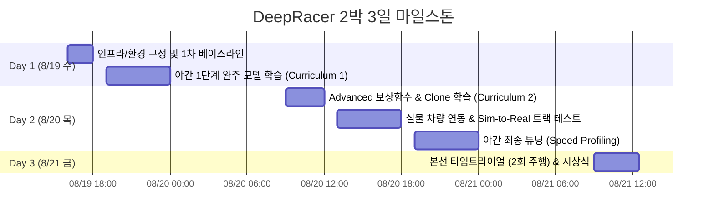

# 경북대 X 전남대 Physical AI (AWS DeepRacer) 경진대회 요강 & 전략 개요

---

## 1. 대회 핵심 개요

* **대회명**: 경북대학교 X 전남대학교 Physical AI 경진대회 (AWS DeepRacer)
* **일정**: 2026년 8월 19일(수) ~ 8월 21일(금) (2박 3일)
* **본선 일시**: 2026년 8월 21일(금) 10:00 ~ 12:00 (2시간)
* **장소**: 라한 셀렉트 카펠라홀
* **규모**: 총 40명 (4인 1팀, 총 10팀)
* **상금 규모**:
  * 🥇 **1등 (대상)**: 200만 원 (1팀)
  * 🥈 **2등 (최우수)**: 150만 원 (2팀)
  * 🥉 **3등 (우수)**: 100만 원 (2팀)

---

## 2. 경기 룰 및 평가 기준 (핵심 승리 포인트)

1. **주행 방식**: Time Trial (타임 트라이얼 - 랩타임 경쟁)
2. **시도 횟수**: 팀당 **총 2번의 주행 기회** 부여 ➔ **최단 기록(Best Lap) 채택**
3. **Off-track(트랙 이탈) 페널티**:
   * 차량이 트랙을 벗어날 경우 지정 위치에서 리셋되며 **1초 페널티** 부과
   * **동점 시 페널티 횟수가 적은 팀이 우선 순위**
4. **승리 공식**:
   $$\text{Final Time} = \text{Lap Time} + (\text{Off-Track Counts} \times 1.0\text{s})$$
   * **무조건 0-Off-track(무탈선) + 최적 In-Out-In 궤적 주행**이 승패를 결정함.

---

## 3. 2박 3일 타임라인별 미션 & 체크리스트

### [DAY 1 - 8/19(수)] 기반 마련 및 1차 자율주행 모델
* **16:00 ~ 18:00**: 자체 인프라 점검, 가상 트랙 환경 구성, 모델 학습 파이프라인 확인
* **19:00 ~ 23:00 [야간실습]**:
  * **목표**: **100% 완주율(Completion Rate)**을 보장하는 베이스라인 모델 확보
  * **속도**: 1.0 ~ 1.5 m/s 수준으로 저속 안정 주행 모델 구축 (40~60분 학습)

### [DAY 2 - 8/20(목)] 고도화 및 물리 트랙(Physical Track) 실차 테스트
* **09:00 ~ 12:00**: Clone Training (2단계 레이싱 라인 학습, 60분)
* **13:00 ~ 18:00 [중요] 실물 차량 트랙 주행 실습**:
  * 조향 영점(Calibration) 테스트
  * 조명 및 마찰력 적응 (Sim-to-Real 갭 확인)
  * 차체 떨림(Wobble) 발생 여부 체크
* **19:00 ~ 23:00 [야간실습]**:
  * 속도 가속화 (최고 속도 2.0~2.5 m/s 캡) & 최종 모델(Clone 3단계) 확정

### [DAY 3 - 8/21(금)] 본선 (10:00 ~ 12:00)
* 완충 배터리 교체 확인
* 1차 주행: 안전 확보용 모델 투입 (100% 완주, 페널티 0회 확보)
* 2차 주행: 공격적 스피드 모델 투입 (최단 랩타임 갱신)
